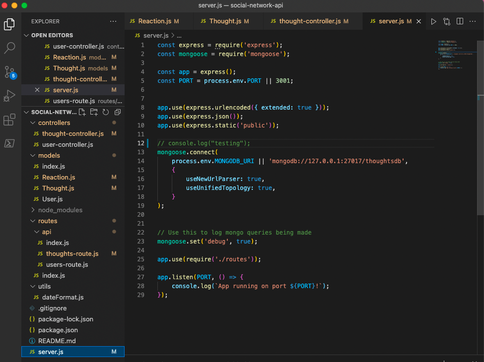
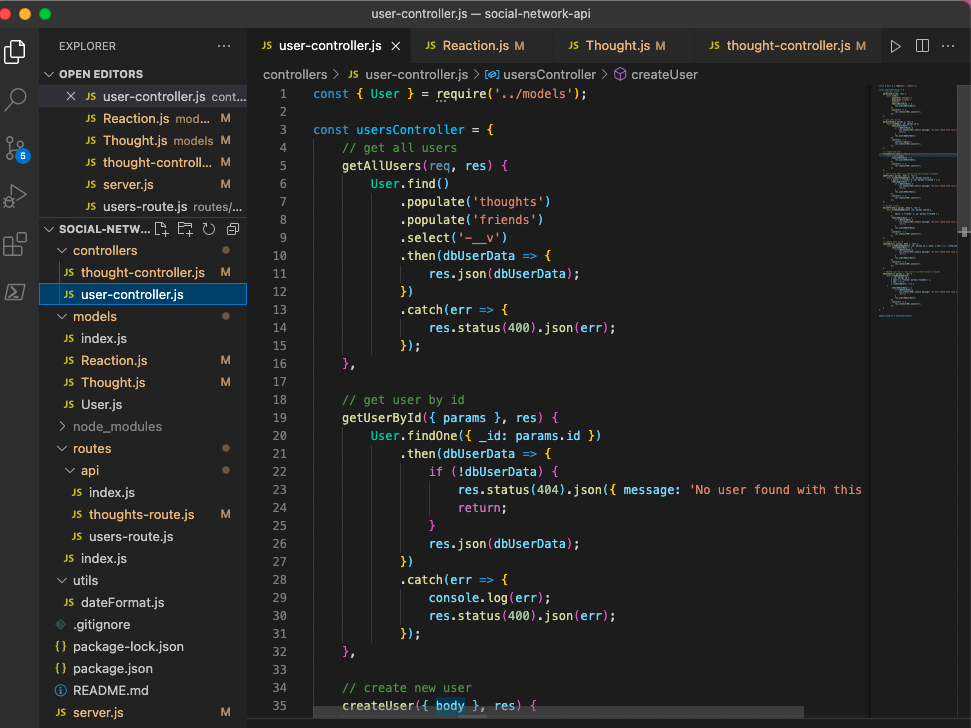
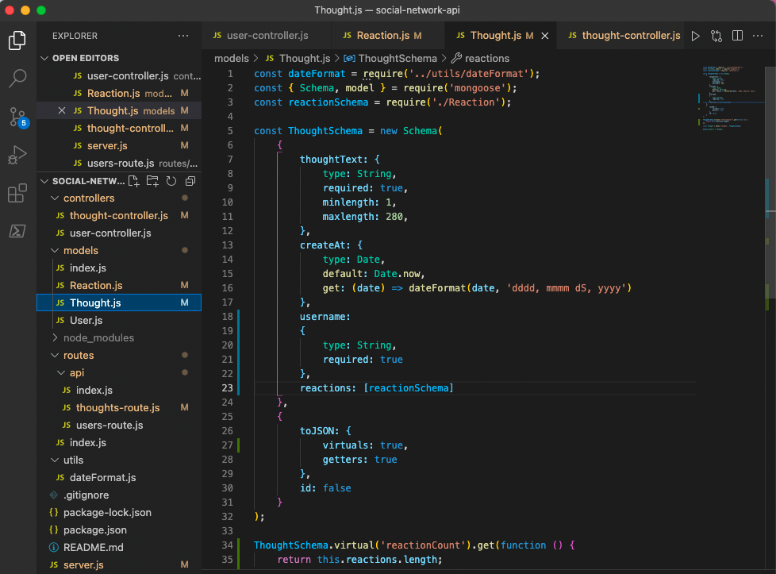
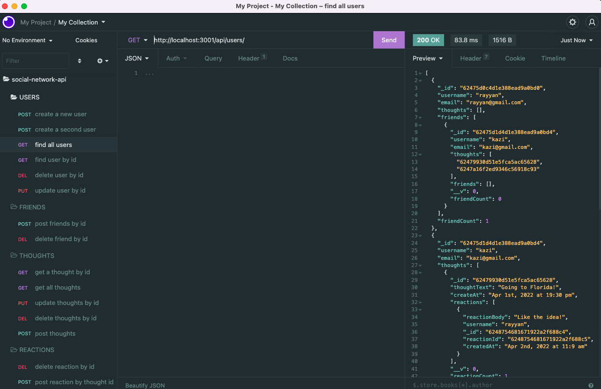
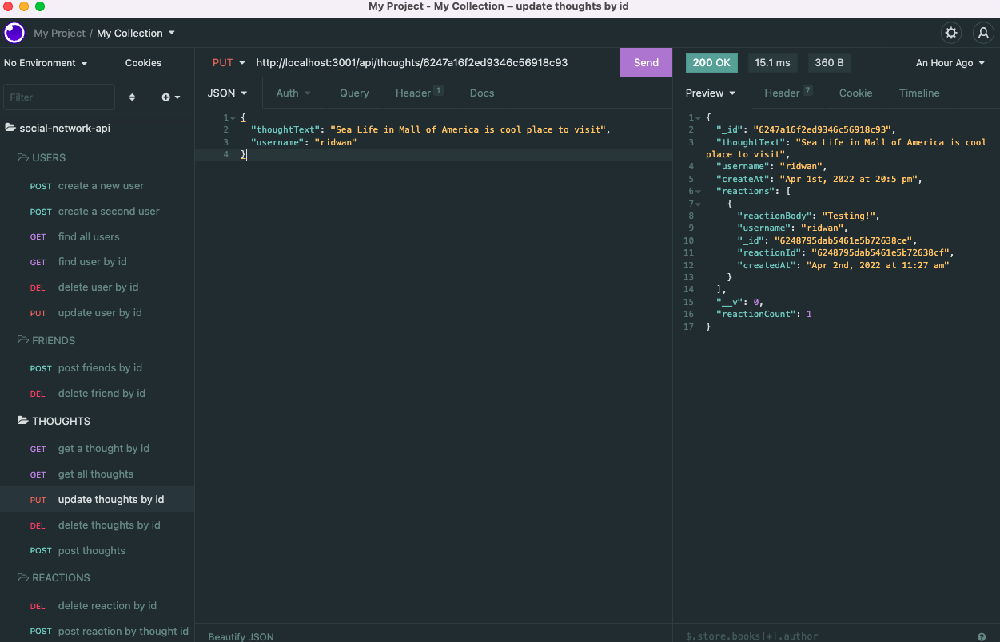

# Social-Network-API

## Table of contents

1. [Title](#title)
2. [Description](#description)
3. [Installation](#installation)
4. [Usage](#usage)
5. [Contributing](#contributing)
6. [Test](#test)
7. [License](#license)
8. [Questions](#questions)

## Title

Social-Network-API

## Description

Build an API for a social network web application where users can share their thoughts, react to friends’ thoughts, and create a friend list

## Installation

run `npm install express mongoose`

## Usage

Use `insomnia, postman or CURL with proper body information; see screenshot for detail`

## Contributing

Always create a branch and do PR once ready

## Test

Test on local environment

## License

[Apache](https://gist.github.com/nicolasdao/a7adda51f2f185e8d2700e1573d8a633#apache-license-20)

## Questions

Do not have any question at this time 
Find me on Github [kazichaska](https://github.com/kazichaska) 
Email me with any question: kazichaska@gmail.com  

## Deployed Application Video Link

Below is the recorded video link of deployed application and how to use it:
https://youtu.be/BcqWuxNuLOg  
https://youtu.be/B8OsorKJb5M  

## Screenshots of the code

